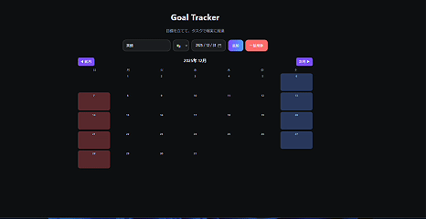

# Goal Tracker

目標とタスクをまとめて管理できる、シンプルな目標管理 Web アプリです。  
タスクは自動生成され、進捗・期限・カレンダーを一目で確認できます。

---

## 🎥 デモ

　

---

## ✨ 主な機能
- 目標の作成（期限・アイコン付き）
- 目標内容に応じたタスク自動生成
- タスクごとの期限設定
- 月間カレンダーで全タスクを一括管理
- 目標ごとの進捗率（％）表示
- 期限前（3日前・当日）の通知表示
- データ自動保存（localStorage）

---

🛠 使用技術
- HTML / CSS / JavaScript
- localStorage
- 日本の祝日 API（holidays-jp）

---

## 📖 使い方
1. 目標名・アイコン・期限を入力して「追加」
2. 自動生成されたタスクを進める
3. タスクに日付を設定するとカレンダーに反映
4. 進捗と期限を確認しながら目標を達成

---

## 📂 ファイル構成
- index.html
- style.css
- script.js
- demo.gif（任意）

---

## 🚀 今後追加したい機能（アイデア）
- タスクの並び替え（ドラッグ＆ドロップ）
- 目標・タスクの編集機能
- 週 / 日ビューのカレンダー切り替え
- 目標ごとのメモ・振り返り欄
- 通知のON / OFF設定
- モバイル表示の最適化

---

🏁 おわりに
Goal Tracker は
**「目標 → 行動 → 可視化」**を続けるためのアプリです。
日々の目標管理にぜひ活用してください。